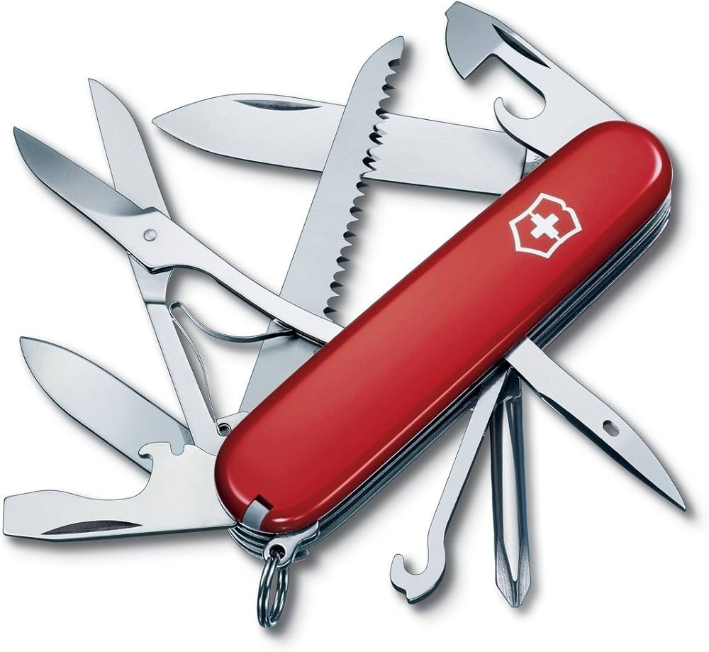

# The-Swiss-Army-Knife 🛠️

[](https://github.com/Senzokuhle/The-Swiss-Army-Knife)
[](https://github.com/Senzokuhle/The-Swiss-Army-Knife)
[](https://opensource.org/licenses/MIT)
[](https://senzo.github.io/The-Swiss-Army-Knife)

A collection of essential web-based utilities featuring password generation, mathematical calculations, lottery number generation, and validation tools for South African phone numbers and email addresses.

 <!-- Add actual screenshot path -->

## ✨ Features

### 🔒 Password Generator
- Customizable password length (8-32 characters)
- Optional inclusion of uppercase, numbers, and symbols
- One-click copy functionality

### 🎰 SA Lotto Generator
- Generates valid SA Lotto (6/52) numbers
- Produces PowerBall (5/50 + 1/20) combinations
- Copy-friendly number blocks display
- Dynamic number formatting

### 📱 Cell Number Validator
- Validates South African mobile numbers
- Supports multiple formats (071 123 4567, 071-123-4567)
- Real-time validation feedback

### 📧 Email Validator
- RFC-compliant email format validation
- Instant validity indication
- Responsive error handling

### 🖩 Calculator
- Basic arithmetic operations
- Complex expression evaluation
- Error detection and handling

### 🎨 UI Features
- Dark/Light mode toggle
- Responsive design
- Accessible navigation
- Cross-browser compatibility
- Print-friendly layouts

## 🚀 Getting Started

### Prerequisites
- Modern web browser (Chrome 90+, Firefox 88+, Safari 14+)
- Internet connection (for initial load)

### Installation
1. Clone the repository:
```bash
git clone https://github.com/yourusername/The-Swiss-Army-Knife.git
